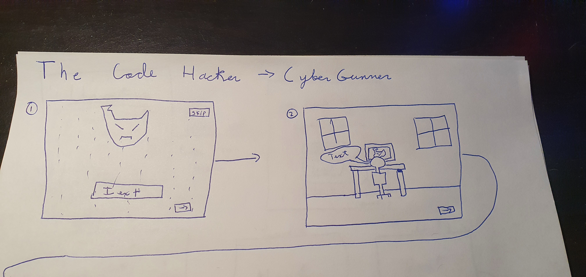
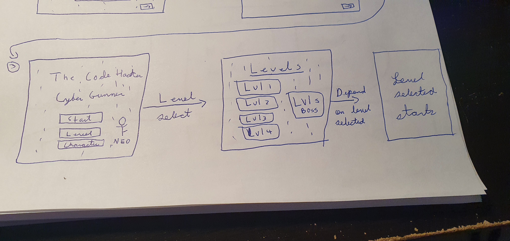
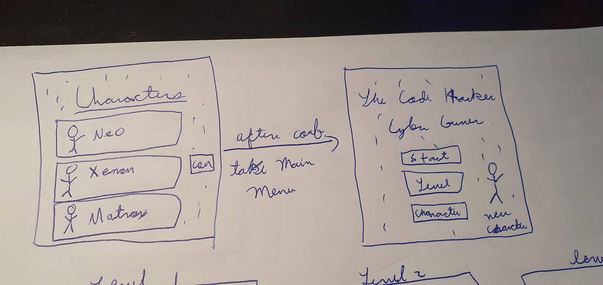
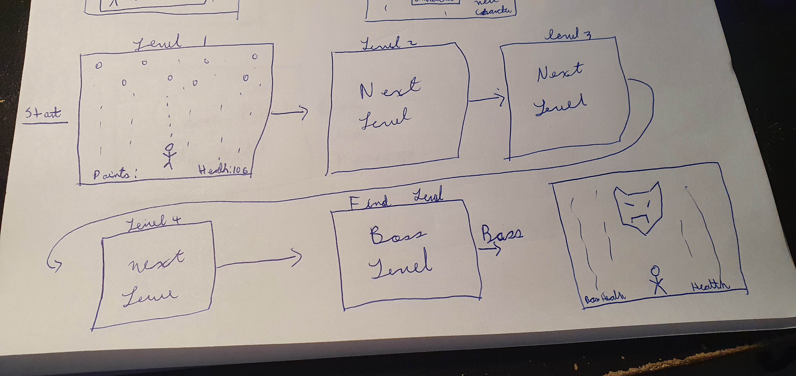
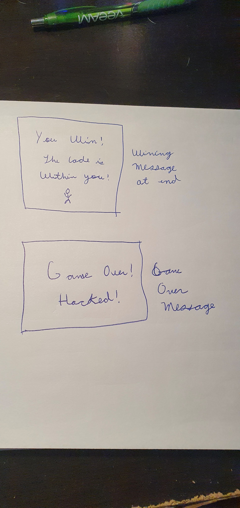
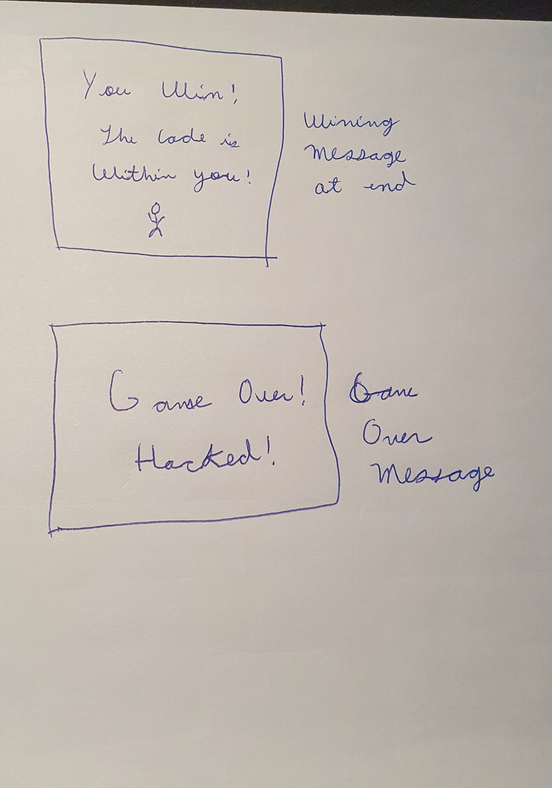

Technical requirements:

    1. Should display game in browser
    2. Should have two players or obstacles
    3. Should have a logical winning goal
    4. Display when the player win or losses
    5. Include:
        - HTML
        - CSS
        - JS
    6. Should have the priniples:
        -KISS = Keep It Simple Stupid
        -DRY = Dont Reapet Yourself
    7. Use the JS to do DOM manipulation
    8. Should deploy online and be able to be playeble by other playes online
    9. Semantic markup for HTML and CSS

Game: The Code Hacker - CyberGunner

Type: Shooting Game, 2d platform, Canvas

User Story:

    1. Have an intro with a brief explanation and a short story
    2. Only two iterations of story to proceed
    3. Button needed to proceed to main menu
    4. Also include a "Skip" button to skip the short story 
    5. Main menu present the following:
        1. The title of the game
        2. Background changing (matrix style) (main color = black and neon green)
        3. Start button
        4. Select Level button
        5. Select character
        6. Also show the Character the player has in the time, Default = Neo
    6. Action from Selecting level button:
        1. Pressing the "Level" button takes the player to another page
        2. New page shows 5 levels to shows from
        3. Selecting any level take syou automatically to the level 
        4. Starting the level the player will start with full health
        5. To pass the level will require certain points without the player health reaching 0
        6. Health reaches 0 means 'Game Over'
        7. 'Game Over' will show 2 buttons:
            1. "Main Menu" = takes th eeplayer to the main menu and resets the game
            2. "Restart Level" = refreshes the game in the current level the player choiced from
    7. Action from Selecting Character button:
        1. Pressing the "Character" button takes the player to another page
        2. New page will show 3 characters
        3. Selecting a character will change the original character to the character the player choosed
        4. Three character possible:
            1. Neo (default Character) = Character with average health and average fire rate
            2. Xenon = Character with bit lower health but higher fire rate
            3. Matrox = Character with higher health but lower fire rate
        5. After the Character is selected , have a button to comfirm the selection
        6. Pressing the Confirm Button changes the default character to the selected Character
        7. Confirm Button will also take you yo back to the main menu
        8. Main Menu should show the change in character of the Character the player choice
    8. Action from Selecting the Start button:
        1. Should start the Game in Level 1 
        2. Depending on the Character Selected the health and fire rate will vary
    9. After deafeting the game in final level:
        1. Display a Winning message
        2. Add a button to return to main Menu

Game Mechanics:

    1. Goal:
        - Reach a certain goal of points to proceed up the levels
        - Once you reach Final level 5 <- This should be a boss fight

    2. Player Character:
        - Should move up, down, left and right starting from the botton up to certain height of the gaming canvas
        - Assure the health and fire rate goes with the selected Character
        - Health should go down 5 or 10 at a time when hit
        - Stop shooting when hit

    3. Enemies:
        - Enemies should fall down from top of the canvas
        - Enemies should be random at falling
        - Have diferent dificulty of enemies
            -Difficulty(at least 2):
                -Easy = 2 shots to kill
                -Hard = 3 or more to kill
        - Should also move left to right 
        - Dissapear when hit at according kill rate

    4. Player Death:
        - Should display an "Game Over" message
        - Display according buttons
        - Display the score reached in level

Future Adding and upcoming Updates:

    1. More enemies
    2. More Character (at least 2 more)
    3. More challenging levels
    4. Extra "Tripy" Level
    5. Diferent bosses
    6. Timed Level
    7. Weapons = Different weapons with stats
    8. Power ups during the levels
    9. Save progress and continue feature 

